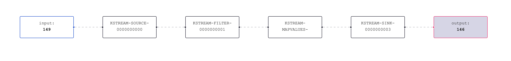
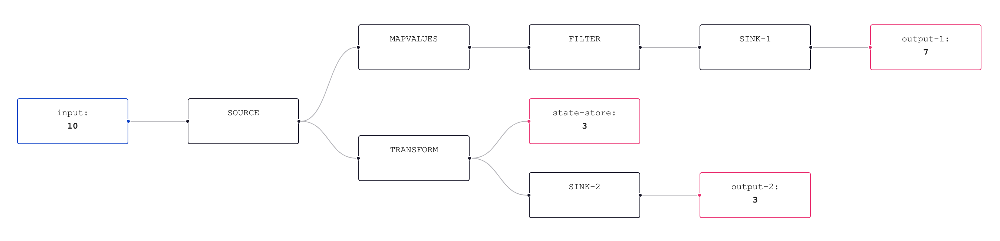

# kafka-flow

Visualize the data flowing through a kafka streams topology.

## Running Kafka Stream

## Stopped Kafka Stream

## Settings

### Topology

| Setting              | Description                                                                            | Default  |
|----------------------|----------------------------------------------------------------------------------------|----------|
| Topology Description | The textual representation of a topology                                               | Example  |
| Topology URL         | URL to load the topology. Click `Load Topology` to load and fill Topology Description  |          |
| Show internal stores | Show / Hide internal stores from the topology                                          | `true`   |

### Offsets

| Setting               | Description                                                      | Default |
|-----------------------|------------------------------------------------------------------|---------|
| Enable offset polling | Should offsets be displayed and updated in the topology          | `false` |
| Offset url            | URL to load the offsets. Must be in format `[endpoint]/[topic]`  |         |
| Offset interval (ms)  | Interval for offsets to be polled in ms                          | 2000    |
